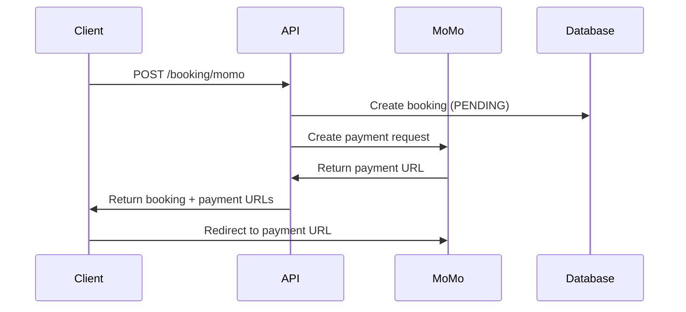
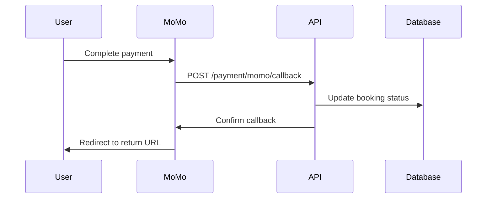

# 💳 Payment Integration (MoMo & VNPay)

## 📋 Overview

This document describes the payment integrations (MoMo & VNPay) for the movie booking system. Both integrations support creating payment requests, handling callbacks, and managing payment status.

## 🛠️ Setup

### 1. Environment Variables

Add the following variables to your `.env` file:

```env
# MoMo Payment (Test Environment)
MOMO_PARTNER_CODE="MOMO"
MOMO_ACCESS_KEY="F8BBA842ECF85"
MOMO_SECRET_KEY="K951B6PE1waDMi640xX08PD3vg6EkVlz"
MOMO_ENDPOINT="https://test-payment.momo.vn/v2/gateway/api/create"

# VNPay Payment (Test Environment)
VNPAY_TMN_CODE="your-test-tmn-code"
VNPAY_HASH_SECRET="your-test-hash-secret"
VNPAY_URL="https://sandbox.vnpayment.vn/paymentv2/vpcpay.html"

BASE_URL="http://localhost:8000"
```

### 2. Dependencies

The integration uses the following packages:
- `crypto-js` - For signature generation and verification
- `axios` - For HTTP requests to MoMo API

## 🚀 API Endpoints

### 1. Create Booking with MoMo Payment

```http
POST /booking/momo
Content-Type: multipart/form-data

{
  "userId": 1,
  "showtimeId": 1,
  "seatIds": [1, 2, 3],
  "paymentMethod": "MOMO",
  "file": <optional image file>
}
```

**Response:**
```json
{
  "data": {
    "booking": {
      "id": 1,
      "bookingCode": "BK-1234567890-abc123",
      "totalPrice": 120000,
      "status": "PENDING"
    },
    "payment": {
      "payUrl": "https://test-payment.momo.vn/gw_payment/...",
      "qrCodeUrl": "https://test-payment.momo.vn/qr/...",
      "deeplink": "momo://..."
    }
  }
}
```

### 1.1. Create Booking with VNPay Payment

```http
POST /booking/vnpay
Content-Type: multipart/form-data

{
  "userId": 1,
  "showtimeId": 1,
  "seatIds": [1, 2, 3],
  "paymentMethod": "VNPAY",
  "file": <optional image file>
}
```

**Response:**
```json
{
  "data": {
    "booking": {
      "id": 1,
      "bookingCode": "BK-1234567890-abc123",
      "totalPrice": 120000,
      "status": "PENDING"
    },
    "payment": {
      "vnpUrl": "https://sandbox.vnpayment.vn/paymentv2/vpcpay.html?..."
    }
  }
}
```

### 2. MoMo Callback (Webhook)

```http
POST /payment/momo/callback
Content-Type: application/json

{
  "partnerCode": "MOMO",
  "orderId": "BK-1234567890-abc123",
  "requestId": "BK-1234567890-abc123",
  "amount": 120000,
  "resultCode": 0,
  "message": "Success",
  "extraData": "1",
  "signature": "..."
}
```

### 3. MoMo Return URL

```http
GET /payment/momo/return?resultCode=0&orderId=BK-1234567890-abc123&message=Success
```

## 🔄 Payment Flow

### 1. Create Booking with Payment



### 2. Payment Completion



## 💰 Pricing Logic

The system applies the following pricing rules before creating MoMo payment:

1. **Base Price**: Sum of selected seat prices
2. **Student Discount**: 20% off if user role is "student"
3. **Peak Hour Surcharge**: +20,000 VND for weekends or after 6 PM
4. **Showtime Price**: Additional showtime-specific pricing

### Example Calculation

```typescript
// Base seat prices
let totalPrice = seats.reduce((sum, seat) => sum + seat.price, 0);

// Student discount
if (user.role === "student") {
  totalPrice *= 0.8; // 20% discount
}

// Peak hour surcharge
const isPeakHour = showtimeDate.getDay() >= 5 || showtimeTime > "18:00";
if (isPeakHour) {
  totalPrice += 20000;
}

// Add showtime price
totalPrice += showtime.price;
```

## 🔐 Security

### Signature Verification

All MoMo callbacks are verified using HMAC-SHA256 signature:

```typescript
const rawSignature = `accessKey=${accessKey}&amount=${amount}&extraData=${extraData}&message=${message}&orderId=${orderId}&orderInfo=${orderInfo}&orderType=${orderType}&partnerCode=${partnerCode}&payType=${payType}&requestId=${requestId}&responseTime=${responseTime}&resultCode=${resultCode}&transId=${transId}`;

const expectedSignature = crypto.HmacSHA256(rawSignature, secretKey).toString();
```

## 📊 Booking Status Flow

```
PENDING → CONFIRMED (Payment Success)
PENDING → CANCELLED (Payment Failed)
```

## 🧪 Testing

### Test Credentials (Sandbox)

```env
MOMO_PARTNER_CODE="MOMO"
MOMO_ACCESS_KEY="F8BBA842ECF85"
MOMO_SECRET_KEY="K951B6PE1waDMi640xX08PD3vg6EkVlz"
MOMO_ENDPOINT="https://test-payment.momo.vn/v2/gateway/api/create"
```

### Test Payment

1. Create a booking with MoMo payment
2. Use the returned `payUrl` to access MoMo payment page
3. Use test credentials to complete payment
4. Verify booking status changes to CONFIRMED

## 🚨 Error Handling

### Common Error Scenarios

1. **Invalid Signature**: Returns 400 Bad Request
2. **Payment Timeout**: Booking remains PENDING
3. **Payment Failure**: Booking status changes to CANCELLED
4. **Network Issues**: Retry mechanism with exponential backoff

### Error Response Format

```json
{
  "statusCode": 400,
  "message": "MoMo payment failed: Invalid signature",
  "error": "Bad Request"
}
```

## 📝 Production Deployment

### 1. Update Environment Variables

```env
MOMO_PARTNER_CODE="your-production-partner-code"
MOMO_ACCESS_KEY="your-production-access-key"
MOMO_SECRET_KEY="your-production-secret-key"
MOMO_ENDPOINT="https://payment.momo.vn/v2/gateway/api/create"
BASE_URL="https://your-production-domain.com"
```

### 2. Configure Webhooks

Ensure your production server can receive POST requests at:
- `https://your-domain.com/payment/momo/callback`

### 3. SSL Certificate

MoMo requires HTTPS for production webhooks.

## 🔍 Monitoring

### Key Metrics to Monitor

1. Payment success rate
2. Callback response time
3. Signature verification failures
4. Booking status distribution

### Logging

The system logs the following events:
- Payment request creation
- Callback reception
- Signature verification results
- Booking status updates
